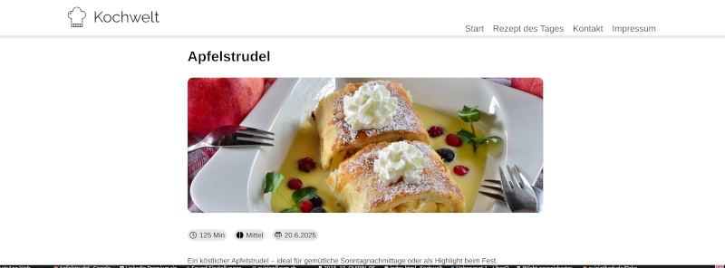

# Kochwelt – Recipe Website (Team Project)

Kochwelt is a recipe website developed as a team project during the Developer Akademie program.

The goal of the project was to build a modern recipe platform similar to chefkoch.de with responsive layouts and dynamic UI components.

## Screenshot

## My Contributions

In this project I focused mainly on the frontend layout and UI behavior:

- building the HTML structure for the recipe sections
- implementing responsive layouts using CSS
- creating the horizontal recipe slideshow
- working with DOM manipulation and template strings
- structuring HTML, CSS and JavaScript in separate files

## Technologies

- HTML
- CSS
- JavaScript
- responsive web design

## Original Repository

This project was developed in a team and is hosted in another GitHub repository:

https://github.com/LittleSaint91/Kochwelt

## What I learned

Working on this project helped me practice:

- collaborating in a team environment
- structuring frontend code
- implementing responsive layouts
- working with JavaScript-driven UI components
